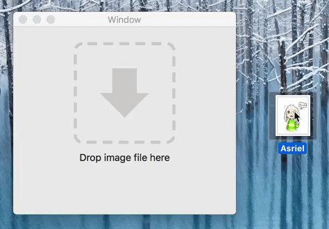
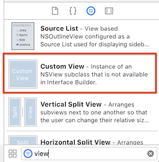

# ADragDropView

> Add a Drag and drop view (swift) for your macOS app easily

I used this in my mac app, [PDF Page Number + Watermark](https://pdfpagenumber.com)





## Requirements

- macOS 10.12+
- Xcode 9.4.1+
- Swift 4.1+


## Install

### Manual
Copy the `ADragDropView.swift` and `NSDraggingInfo+FilePathURL.swift` inside the `ADragDropView` folder to your project.


### CocoaPods

```ruby
pod 'ADragDropView'
```


## Usage

*Run the `ADragDropViewExample` target in Xcode to try the demo.*


Drag and drop a **Custom View** to your view controller in Interface Builder, set its class to **ADragDropView** and create an IBOutlet for it.




Set delegate (usually to the view controller), `dragDropView.delegate = self` . 

Set the allowed file extensions: `dragDropView.acceptedFileExtensions = ["png", "jpg", "jpeg", "gif"]` .


Implement the two delegate methods to handle dropped file(s) :  

```swift
extension ViewController: ADragDropViewDelegate {
    // when one file is dropped
    func dragDropView(_ dragDropView: ADragDropView, droppedFileWithURL URL: URL) {
        
        // action to do when the file is dropped
    }
    
    // when multiple files are dropped
    func dragDropView(_ dragDropView: ADragDropView, droppedFilesWithURLs URLs: [URL]) {
        
       // action to do when the files are dropped
    }
}
```

